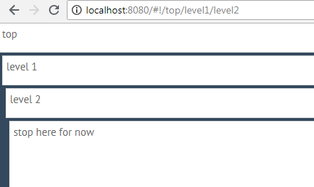
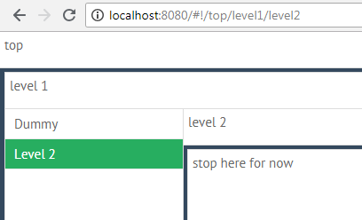
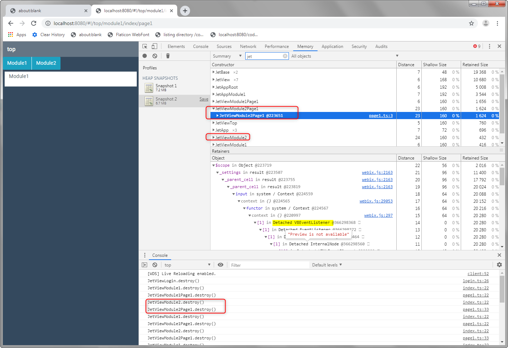
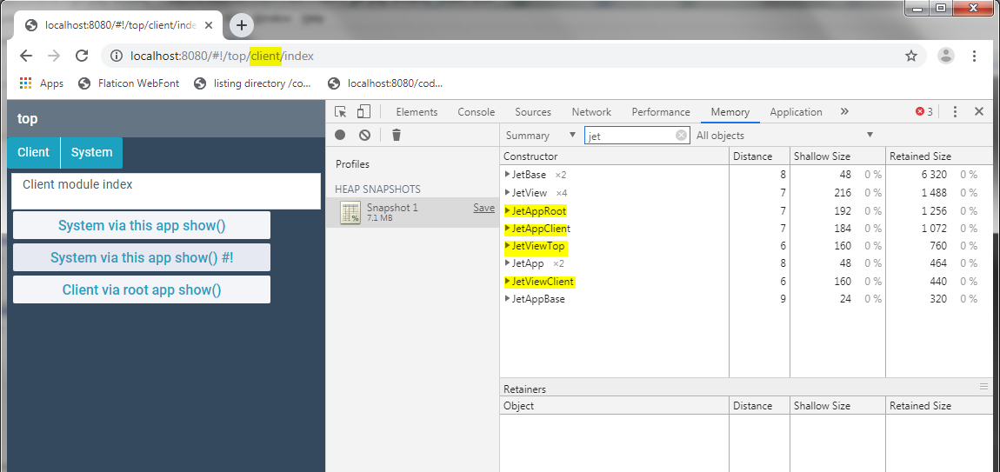
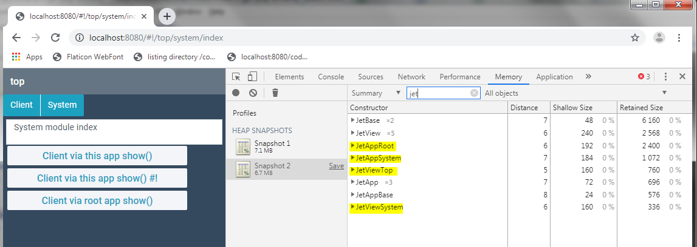

jet-play
=====


Branch **b4** illustrates the current problem in switching between sub-apps

The structure is a main app with sub-apps/modules (webpack chunks) that live in the *modules/<modulename>* folder.

Two sub-apps
* client
* system


## Issue 1: JetView.destructor this._root is undefined and cannot execute this._root.destructor() ##


Load app with /top/client/index by default



Switch to /top/system/index



Switch to /top/client/index




The following code works around the issue. Not sure why this._root is undefined.

```
destructor(){
	this.destroy();
	this._destroyKids();

	// destroy actual UI
	if (!this._root) {
		console.log("JetView.destructor() this._root is undefined and cannot execute this._root.destructor()")
	} else {
		this._root.destructor();
	}
	super.destructor();
}
```


## Issue 2: Are JetApp instances destroyed properly? ##

Just starting to look at this one, and noticing that there are things left behind that I expect to be destroyed.
Could be faulty process on my part. Further investigation required.

JetApp instances seem to grow with every switch. In my dev project instances of other views and data objects related to should be destroyed apps continue to multiply.

Will flesh out the example once issue 1 is resolved.  

### Update 1: ###

I have updated the names of the main views so filtering on "jet" will order things nicely.

* JetApp instances stay at 3. (This must be expected.) 
* The views are destroyed. 





Possibly something is pinning the apps in my work project, as this so far look ok. Will continue adding tests and information.


## Issue 3: Navigation between modules is a bit inconvenient ##

When working with sub-apps, I find it useful to have a handle for the root app. This is currently done for each app as follows.

```
export default class JetAppClient extends JetApp {
	public root: JetApp;

	constructor(config:any = {}) {
		const defaults = {
            debug 	: !PRODUCTION,
			id 		: "client",
			version : VERSION,
			start 	: "/index",
            views   : (v) => require("@modules/client/views/" + v)
        };

		super({ ...defaults, ...config });
 
		this.root = config.app as JetApp;
	}
}
```

It works like that, but I find it more convenient for the JetApp to have **root** field defined so I can use it from TypeScript without extra typing.

```
export default class JetViewClient extends JetView {

    config() {
        return {
            rows: [
                { template: "Client module index", height: 40 },
                {
                    cols: [
                        { view: "button", value: "System via this app show()", width: 300,
                            click: () => {
                                this.show("/top/system");
                            }
                        },
                        { view: "button", value: "System via this app show() #!", width: 300,
                            click: () => {
                                this.show("#!/top/system");
                            }
                        },
                        { view: "button", value: "Client via root app show()", width: 300,
                            click: () => {
                                let root: any = this.app["root"];
                                root.show("/top/system");
                            }
                        }
                    ]
                },
                {}
            ]
        };
    }

    init(view, url) {
        console.log("client-index.init()");
    }
}
```

For example

* this.show("/top/system"); //fails with module not found (as expected)
* this.show("#!/top/system"); // fails as path is appended (not sure if #! should indicate to replace path)
* root.show("/top/system"); // works

Also experiencing differences (in dev project not replicated here yet) when I navigate via root.app and top top view (from menu). (Will work on replicating here.) 

