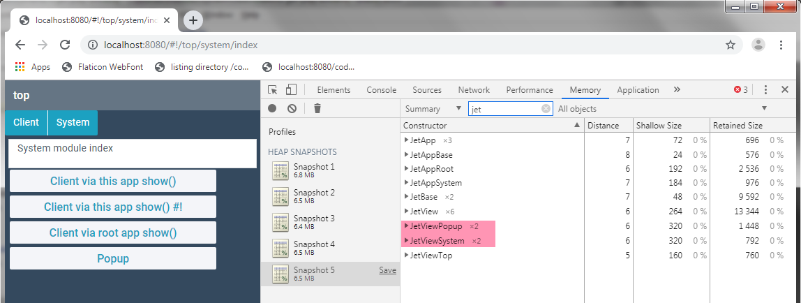
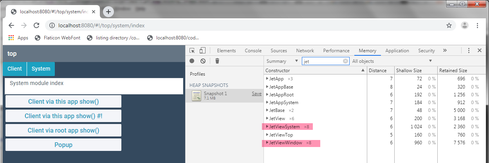

jet-play
=====

Branch **b4** illustrates the current problem in switching between sub-apps

The structure is a main app with sub-apps/modules (webpack chunks) that live in the *modules/<modulename>* folder.

Two sub-apps
* client
* system

## Issue 2: Are JetApp instances destroyed properly? ##

Just starting to look at this one, and noticing that there are things left behind that I expect to be destroyed.
Could be faulty process on my part. Further investigation required.

JetApp instances seem to grow with every switch. In my dev project instances of other views and data objects related to should be destroyed apps continue to multiply.

Will flesh out the example once issue 1 is resolved.  

### Update 1: ###

I have updated the names of the main views so filtering on "jet" will order things nicely.

* JetApp instances stay at 3. (This must be expected.) 
* The views are destroyed. 

Possibly something is pinning the apps in my work project, as this so far look ok. Will continue adding tests and information.

### Update 2: Popup created via this.ui() pin the view and accumulate ###

Custom menus created via this.ui() need not be destroyed, https://webix.gitbook.io/webix-jet/part-ii-webix-jet-in-details/popups-and-windows#adding-a-context-menu

However, this does does not seem true for pupup windows
https://webix.gitbook.io/webix-jet/part-ii-webix-jet-in-details/popups-and-windows#windows-as-jet-view-classes

Switching back and forth between **client** and **system** sub-app makes the popup view grow. I did garbage collection, but that did not change anything. 

Pop returns a promise. So I simplified the popup (win.ts) to eliminate the popup code as the reason, as much as possible. Issue persists.

