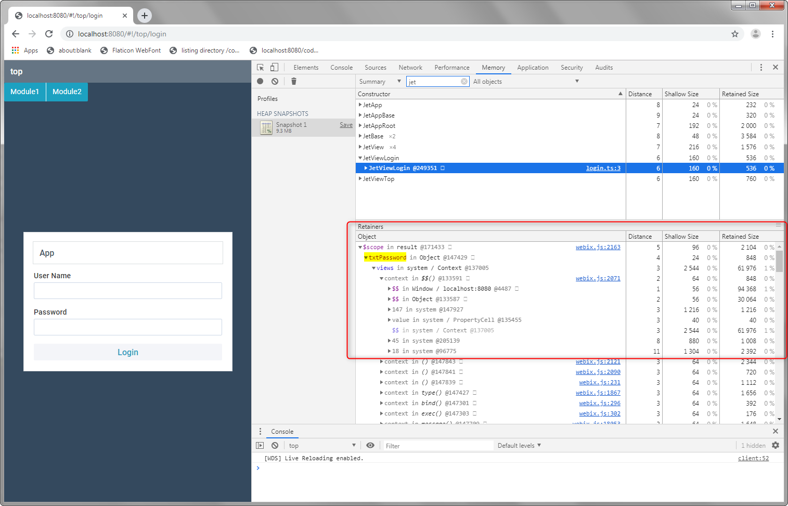

jet-play
=====

Just a bit of play in order see the problem clearly.

The webix-jet TypeScript code is included in the project directly to make it easier to debug.

Dealing with nested subviews, and later with bundled subviews.

Branch **b1** is a simple case. Works great.

Branch **b2** is similar to *master*, but the *level2* subview is loaded when an item is selected from a list.

Branch **b3** moves the *level1* and *level2* subviews in to a module. The module is bundled into **level1** webpack chunk.

With **webix-jet** as is, loading of *level2* subview fails.

Modified **webix-jet** works.

There is probably a more elegant way to solve this. 

The solution assumes that bundled chunks will go into a folder called *modules*. It works by enabling the JetApp::loadView to make a decision about where to *require* the page from. 

https://github.com/emilkm/jet-play/commit/d85f888e41a4b13c7d50e859c60d0840c41d78c8