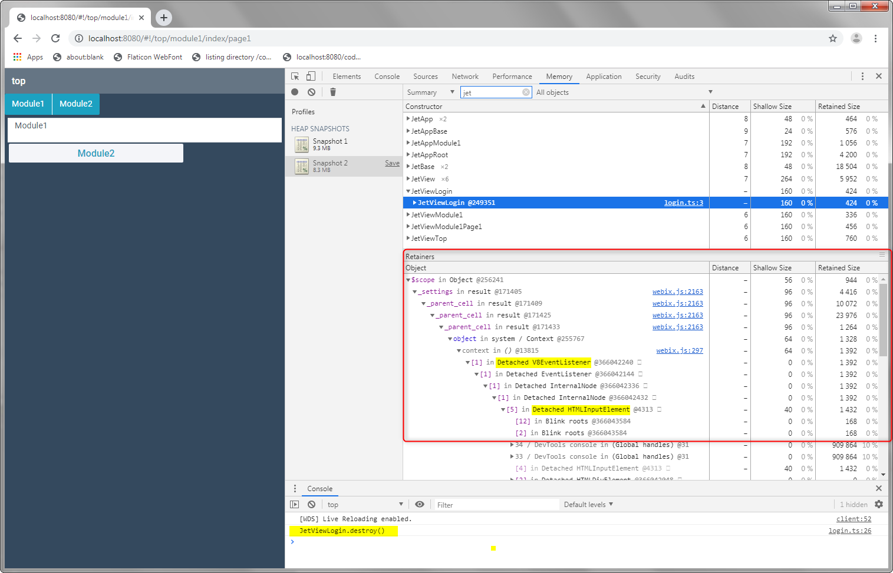

jet-play
=====

Just a bit of play in order see the problem clearly.

The webix-jet TypeScript code is included in the project directly to make it easier to debug.




Branch **b4** moves the *level1* and *level2a*, *level2b* subviews in to a module. The module is bundled into **level1** webpack chunk.

The URL part of the sub-app/module is displayed as one navigates the UI and causes the different view to be loaded.


```typescript
export abstract class JetBase implements IJetView{
	public app: IJetApp;
	public webixJet = true;
	public rootApp: IJetApp;
```

JetBase has a new public field rootApp, which is assigned in the sub-app constructor.

```typescript
export default class App extends JetApp {
	constructor(config = {}) {
		const defaults = {
			id 		: "level1",
			version : VERSION,
			router 	: SubappRouter,
			debug 	: !PRODUCTION,
			start 	: "/level1",
            root	: "/top",
			rootevs : true,
            views   : (v) => require("modules/level1/views/" + v)
        };

		super({ ...defaults, ...config });
		this.rootApp = config as JetApp;
	}
}
```

The sub-app also adds a config option *rootevs*. When that is true, the sub-app JetApp will use the root app's services and event system.

```typescript
if (config.rootevs) {
	this._services = config._services;
	this._events = config._events;
	this["_evs_events"] = config._evs_events;
	this["evs_handlers"] = config._evs_handlers;
	this["_evs_map"] = config._evs_map;
	this["attachEvent"] = config.attachEvent;
	this["blockEvent"] = config.blockEvent;
	this["callEvent"] = config.callEvent;
	this["detachEvent"] = config.detachEvent;
	this["hasEvent"] = config.hasEvent;
	this["mapEvent"] = config.mapEvent;
	this["unblockEvent"] = config.unblockEvent;
} else {
    this._services = {};
    webix.extend(this, webix.EventSystem);
}
```

From the JetApp constructor above. This is probably a naive first attempt. The idea is that a sub-app will be able to have it's own service hash, and event system, or use those of the root app. Initial thinking is that it will probably be more useful that a subapp, has access to the already defined common services and use the same event of the root app (example auth events like logout)

The custom *SubappRouter* seems to do ok for this most basic case. It basically mimics the *EmptyRouter*, and adds a *silent* routie.navigate call in order to update the location.hash

```typescript
set(path:string, config?:IJetRouterOptions){
	this.path = path;
	if (!config || !config.silent){
		setTimeout(() => this.cb(path), 1);
	}

    let hash = window.location.hash || "";
	let rpat = "#" + this._prefix + this.root + this.path;
    console.log("hash=" + hash + " | rpat=" + rpat);
    (routie as any).navigate(rpat, {silent:true});
}
```


